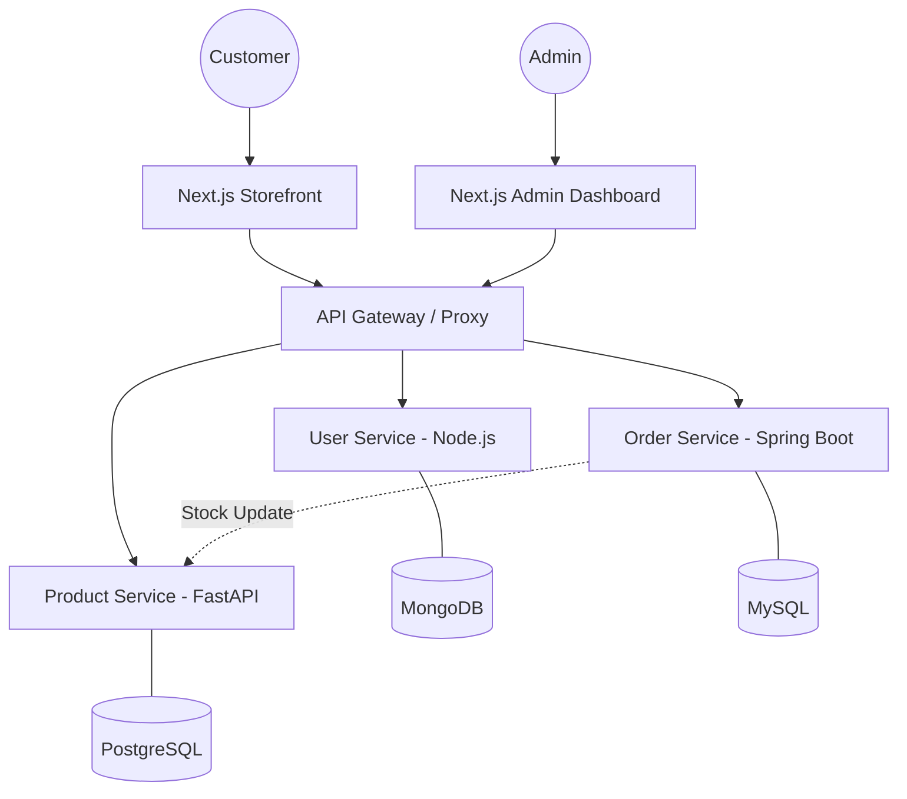

# 🛍️ ElectroZone - Full-Stack Microservices E-Commerce

**ElectroZone** is a high-performance, professional e-commerce platform for high-end electronics. Built with a modern **microservices architecture**, it demonstrates seamless integration between different languages and frameworks, advanced security patterns, and premium user experiences.

[](#)
[](#)


---
## 🖼️ Gallery

### 🛍️ Customer Experience

<p align="center">
  
  
  <br/>
  <em>Modern, responsive catalog with advanced filtering and immersive product views.</em>
</p>

---

### 🛠️ Admin Command Center

<p align="center">
  
  
  <br/>
  <em>Comprehensive analytics dashboard with real-time order processing and management tools.</em>
</p>

---

## 🏗️ Architecture

The platform follows a **Decoupled Microservices Pattern**, ensuring each domain (Users, Products, Orders) is independently scalable and maintainable.



| Service | Technology | Port | Primary Responsibility |
| :--- | :--- | :--- | :--- |
| **Frontend** | Next.js / React | `3000` | Customer Catalog & Checkout |
| **Admin UI** | Next.js / Tailwind | `3001` | Inventory & Order Analytics |
| **User** | Node.js / Express | `5001` | Auth, Identity & Role Management |
| **Product** | FastAPI / Python | `8000` | Catalog Service & Stock Logic |
| **Order** | Spring Boot / Java | `8082` | Transactional Processing & Stripe |

---

## 🛠️ Technology Stack

### **Frontend & UI**
- **Framework:** Next.js 14+ (App Router)
- **Styling:** Tailwind CSS + shadcn/ui
- **State/Data:** React Hooks + Server Actions
- **i18n:** Multi-language support (7+ languages)

### **Backend Ecosystem**
- **Java:** Spring Boot 3, Hibernate, MySQL
- **Python:** FastAPI, SQLAlchemy, PostgreSQL
- **Node.js:** Express, JWT, MongoDB
- **Payments:** Stripe API Integration

---

## ✨ Enterprise Features

- **🔐 Robust Security:** Zero-trust JWT authentication with role-based dashboard access.
- **📦 Smart Inventory:** Atomic stock reduction logic across Product/Order service boundaries.
- **💳 Payment Mastery:** Secure checkout flow using Stripe's latest PaymentIntents.
- **🌐 Global Reach:** RTL support and real-time language switching.
- **📊 Real-time Ops:** Dynamic admin overview with live sales analytics and recent activity tracking.

---

## 🚀 Getting Started

### 🐳 Backend Services (Docker)

Each backend microservice runs inside its own Docker container.

Start them individually:

```bash
# User Service
cd backend-core
docker compose up --build

# Product Service
cd product-service
docker compose up --build

# Order Service
cd order-service
docker compose up --build

# Admin Dashboard
cd admin-dashboard
npm install
npm run dev

# Frontend Store
cd frontend
npm install
npm run dev

```
---

##  Development Team

| Role | Developer | Focus |
| :--- | :--- | :--- |
| **Lead Engineer** | **Ayyoub Asri** | Microservices Architecture & Payments |
| **Security Engineer** | **Missira Abba Boukar** | Auth & Identity Services |
| **UI/UX Designer** | **Meryem Balili** | Frontend Experience |

---

